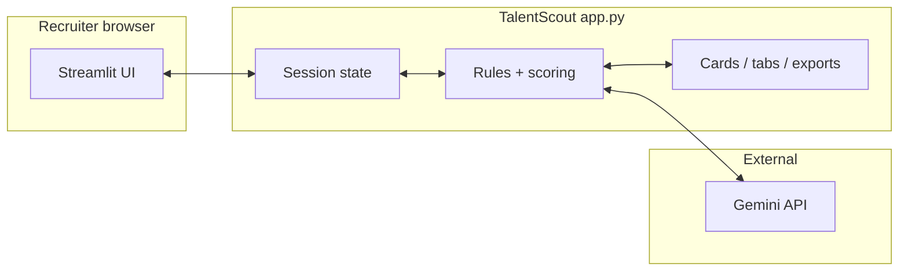
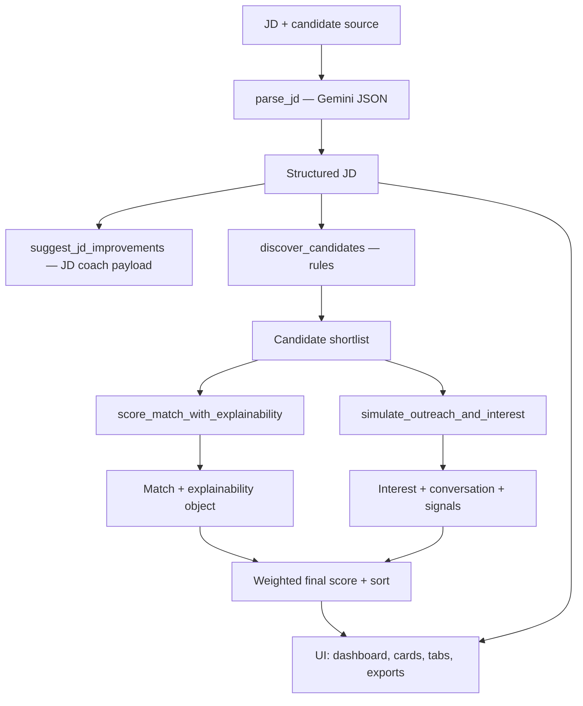
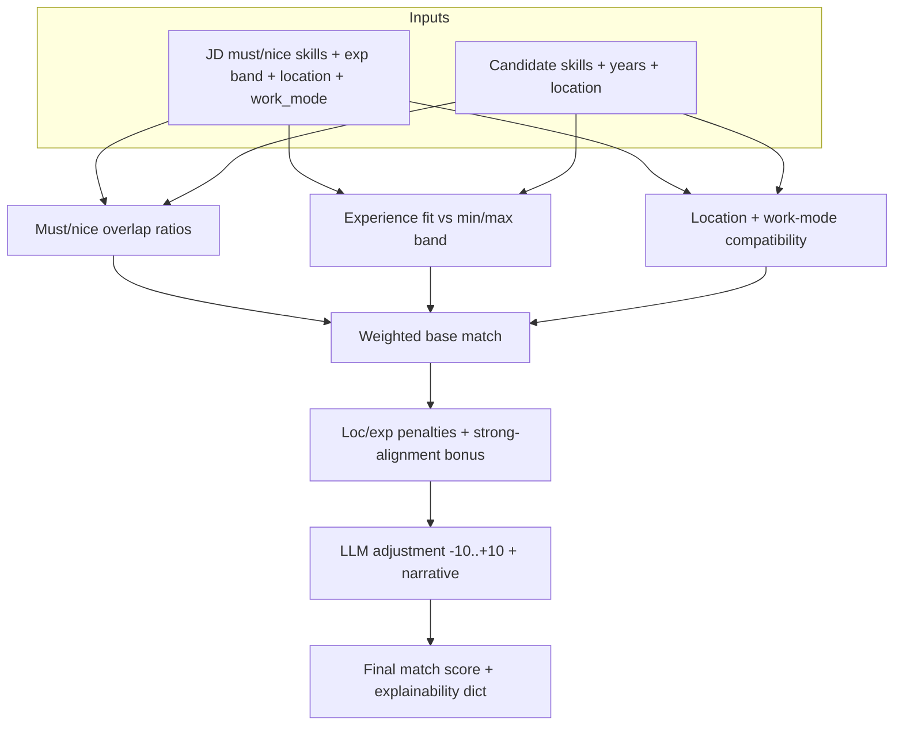
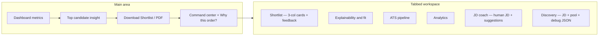

# TalentScout AI

**TalentScout AI** is a recruiter-focused Streamlit application that turns a pasted **job description (JD)** into a **ranked, explainable shortlist** with simulated outreach, ATS-style pipeline tracking, exports, and JD coaching. The goal is a **decision workspace**, not a raw LLM dump.

**Live app:** [ai-talent-scout.streamlit.app](https://ai-talent-scout.streamlit.app) · **Repository:** [github.com/nikithchowdaryachanta/ai-talent-scout](https://github.com/nikithchowdaryachanta/ai-talent-scout)

---

## What it does

| Stage | Description |
|--------|---------------|
| **Intake** | JD text + candidate source (built-in pool, JSON paste, or PDF resumes). |
| **Parse** | Gemini extracts structured JD: role, must/nice skills, experience band, location, work mode, summary. |
| **Discover** | Rule-based pre-filter on must-have overlap and minimum experience. |
| **Score** | Explainable match (skills, experience band, location/work-mode fit, LLM nudge) + simulated 8-turn outreach → interest score. |
| **Rank** | Weighted final score (sidebar match vs interest %) with optional recruiter approve/reject nudge. |
| **Act** | Dashboard, top-candidate insight, CSV/PDF export, pipeline stages, analytics, JD coach. |

---

## Features (current)

- **Dashboard summary:** total analyzed, in-view count, average match/interest, top skill in the current view.
- **Top candidate insight:** callout with “why selected” bullets and traffic-light style score emphasis.
- **Professional candidate cards:** bold name, experience + location, profile skill pills, match/interest/final with **green / amber / red** thresholds, JD must-have **matched vs missing**, alignment hints.
- **Scoring realism:** experience band vs JD; location compatibility; **work mode** (e.g. on-site/hybrid vs remote profile) adjusts location fit; optional **penalties/bonus** on match for weak/strong location + experience alignment.
- **ATS filters (sidebar):** minimum/maximum experience, required skill (substring), title, location, remote-only, **require all JD must-have skills**.
- **In-tab refinement:** multiselect to require selected skills on profiles; shortlist shown in a **3-column** roster with expanders for feedback.
- **Explainability tab:** overlap metrics, charts, narrative, location/experience shaping caption, outreach transcript, human-readable **signals** list.
- **ATS pipeline:** per-candidate stage + summary chart.
- **Analytics:** skills, experience buckets, geography.
- **JD coach:** human-readable **parsed JD card** plus clarity score and suggestions (not JSON-first).
- **Discovery tab:** same JD card with **pool gap** warning + candidate roster; raw JSON only under **debug** expander.
- **Exports:** **Download Shortlist** (CSV) and PDF report (`fpdf2`).
- **Session save:** snapshot shortlist view to sidebar.

---

## Architecture: system context

Single-page Streamlit app (`app.py`) orchestrates UI, session state, and all Gemini calls.



---

## Architecture: end-to-end pipeline



---

## Architecture: match scoring (conceptual)



**Final score (UI):** `match_weight% × Match + interest_weight% × Interest`, then display nudge from recruiter feedback (±3 per vote, session-local).

---

## Architecture: UI surface (tabs)



---

## Tech stack

| Layer | Technology |
|--------|------------|
| UI | [Streamlit](https://streamlit.io/) |
| LLM | [Google Generative AI](https://ai.google.dev/) (Gemini, e.g. `gemini-1.5-flash`) |
| Config | `python-dotenv`, Streamlit secrets |
| PDF in | `pypdf` |
| PDF out | `fpdf2` |
| Charts / tables | `pandas` |

All application logic currently lives in **`app.py`** (intentional for a compact demo; split into modules if the codebase grows).

---

## Local setup

1. **Clone**
   ```bash
   git clone https://github.com/nikithchowdaryachanta/ai-talent-scout.git
   cd ai-talent-scout
   ```
2. **Install**
   ```bash
   python -m pip install -r requirements.txt
   ```
3. **API key** — create `.env` in the project root (file is gitignored):
   ```env
   GOOGLE_API_KEY=your_api_key_here
   ```
4. **Run**
   ```bash
   python -m streamlit run app.py
   ```

---

## Streamlit Community Cloud

1. Connect the GitHub repo and set main file to **`app.py`** (branch `main`).
2. Under **Secrets**, add:
   ```toml
   GOOGLE_API_KEY = "your_api_key_here"
   ```
3. Deploy. Optional: use `.streamlit/secrets.toml` locally only; never commit secrets.

---

## Sample JD (demo)

Paste a JD similar to:

```text
Role: AI/ML Engineer
Location: Remote (India)
Work mode: Remote
Experience: 3+ years

Must have: Python, Machine Learning, SQL, model deployment
Nice to have: NLP, MLOps, cloud (AWS/GCP/Azure)

Build and deploy ML models; collaborate with product and engineering.
```

Then choose **Built-in pool**, **JSON**, or **PDF resume(s)** and click **Run agent**. Use sidebar weights and ATS filters to stress-test the shortlist.

---

## Output shape (what recruiters see)

- **Ranked shortlist** with match, interest, and weighted final scores.
- **Per-candidate explainability:** matched/missing must-haves, fit percentages, notes, optional alignment penalty/bonus line.
- **Outreach simulation:** 8 messages + structured enthusiasm / availability / fit signals (rendered as text, not raw JSON).
- **Parsed JD** as a readable card (role, experience line, location/mode, skills); structured fields still drive scoring internally.

Example ranking (illustrative; numbers vary per LLM run):

```text
1) Arjun V — Match 88 · Interest 76 · Final ~83
2) Rahul N — Match 82 · Interest 73 · Final ~78
3) Meera T — Match 71 · Interest 69 · Final ~70
```

---

## Scoring defaults

- **Final (display):** `Match × match_weight + Interest × interest_weight` (default **60% / 40%**, adjustable in the sidebar).
- **Match:** blended skill + experience + location/work-mode, ATS-style adjustments, then small **LLM adjustment** with narrative.
- **Interest:** from simulated conversation JSON.

---

## Security and data notes

- **`.env`** is listed in `.gitignore` — do not commit API keys.
- LLM outputs can vary; the app uses **fallback JSON** when parsing fails so the UI keeps working.
- **Recruiter feedback** nudges displayed scores for the session only; re-run the agent to refresh base model scores.

---

## Repository layout

```
ai-talent-scout/
├── app.py              # Full Streamlit app + business logic
├── requirements.txt
├── README.md
├── .gitignore
└── .devcontainer/      # Optional VS Code / Codespaces dev container
```

---

## Roadmap ideas

- Split `app.py` into `scoring/`, `ui/`, and `llm/` modules.
- Persist shortlists and feedback to a database.
- Optional OAuth / org tenancy for multi-user deployments.
- A/B weight presets per role family (e.g. IC vs manager).

---

## License / attribution

Built as a demonstration recruitment intelligence workspace. Verify hiring decisions independently; model output is not legal or compliance advice.
