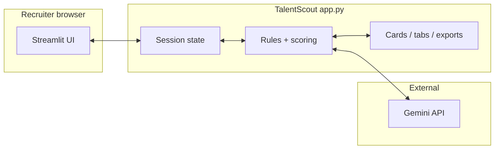
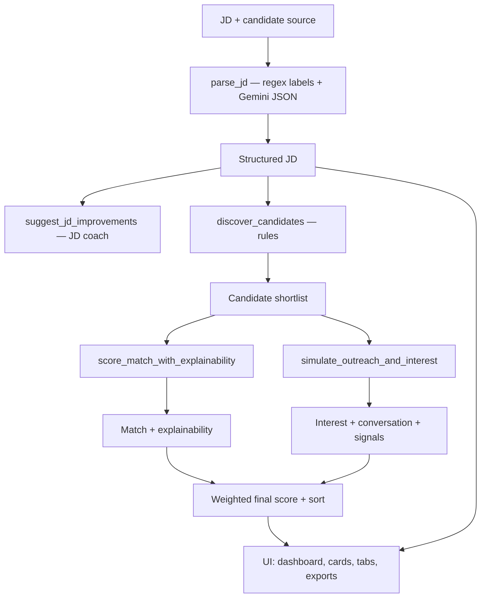
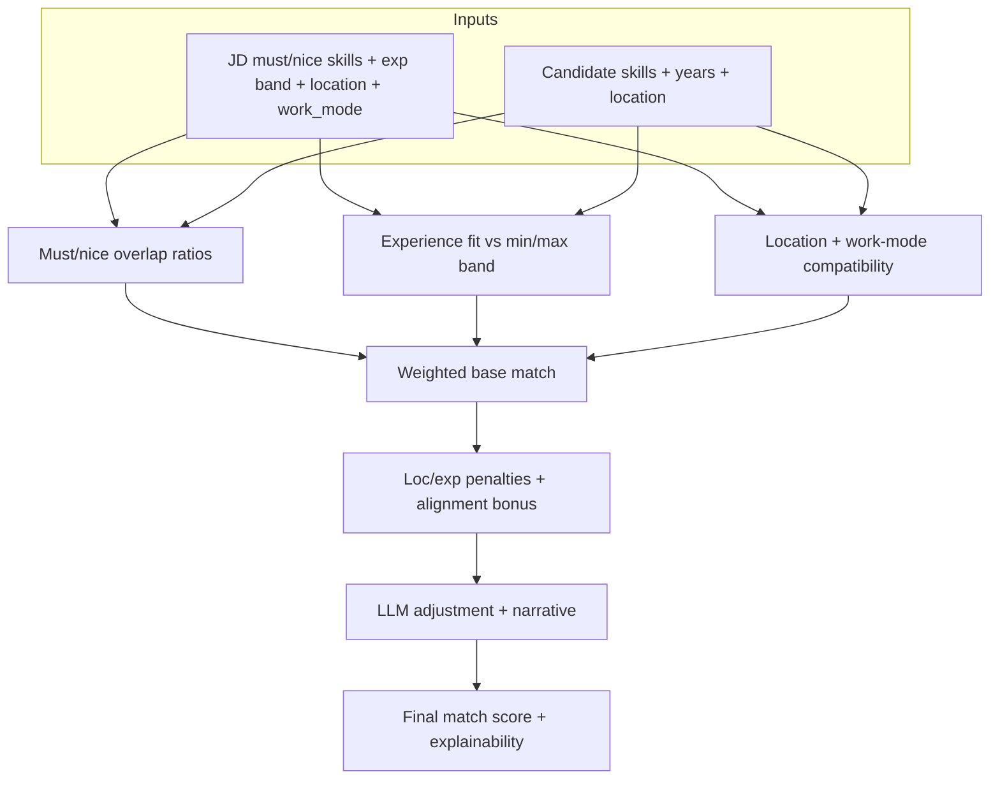
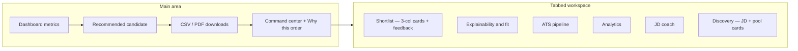

# TalentScout AI

**TalentScout AI** is a recruiter-focused **Streamlit** application that turns a pasted **job description (JD)** into a **ranked, explainable shortlist** of candidates. It combines structured JD parsing (Google **Gemini**), deterministic skill and experience logic, simulated outreach for an **interest** signal, and a polished UI so hiring teams get a **decision workspace**—not a wall of raw model output.

| | |
|:---|:---|
| **Live demo** | [ai-talent-scout.streamlit.app](https://ai-talent-scout.streamlit.app) |
| **Source** | [github.com/nikithchowdaryachanta/ai-talent-scout](https://github.com/nikithchowdaryachanta/ai-talent-scout) |
| **Primary entrypoint** | `app.py` (single file today; see [Roadmap](#roadmap-ideas)) |

---

## Table of contents

1. [Why TalentScout](#why-talentscout)
2. [What it does (pipeline)](#what-it-does-pipeline)
3. [Key capabilities](#key-capabilities)
4. [Matching, scoring, and trust](#matching-scoring-and-trust)
5. [User interface tour](#user-interface-tour)
6. [Architecture](#architecture)
7. [Tech stack](#tech-stack)
8. [Local setup](#local-setup)
9. [Deploying (Streamlit Community Cloud)](#deploying-streamlit-community-cloud)
10. [Trying it with a sample JD](#trying-it-with-a-sample-jd)
11. [What recruiters see (outputs)](#what-recruiters-see-outputs)
12. [Security and limitations](#security-and-limitations)
13. [Repository layout](#repository-layout)
14. [Recent improvements](#recent-improvements)
15. [Roadmap ideas](#roadmap-ideas)
16. [License / attribution](#license--attribution)

---

## Why TalentScout

Hiring tools often show either **opaque scores** or **unstructured LLM text**. TalentScout aims for:

- **Transparency** — Must-have vs nice-to-have overlap, experience band fit, and location / work-mode fit are surfaced per candidate, with charts and short narratives.
- **Consistency** — The same rules drive discovery filters, sidebar filters, in-tab skill chips, and headline match logic where possible, so the UI does not contradict itself.
- **Action** — Exports (CSV, PDF), pipeline stages, JD coaching, and a clear **recommended candidate** block support the next step in a real workflow.

For a concise changelog (including scoring and UX refinements), see **[RELEASE_NOTES.md](./RELEASE_NOTES.md)**—the live app loads that file into a **Release notes** expander so documentation and product stay aligned.

---

## What it does (pipeline)

| Stage | What happens |
|:------|:---------------|
| **Intake** | Recruiter pastes a JD and chooses a **candidate source**: built-in demo pool, **JSON** list of profiles, or one or more **PDF** resumes (text extracted with `pypdf`). |
| **Parse** | **Hybrid:** labeled lines (`Role:`, `Experience:`, `Location:`, `Work mode:`, `Salary:` / `Compensation:`, etc.) are extracted **first** with deterministic regex (regex wins on merge). **Gemini** then fills JSON (skills, narrative fields, gaps). Lists are normalized and deduplicated; if must-haves are empty, the app can infer a block from the JD text. Optional **parse data quality** banner flags generic or missing critical fields (no impact on scores). |
| **Coach (parallel)** | **JD coach** suggestions (clarity score, improvements, gaps) are generated from the JD text plus the structured parse. |
| **Discover** | Rule-based **shortlist** of the pool: must-have overlap and experience when the JD lists must-haves; **experience-based** gate when no must-haves are parsed (avoids fake skill overlap). |
| **Score** | For each discovered candidate: **match** (skills, experience band, location/work mode, small penalties/bonuses, bounded LLM adjustment with narrative) and **interest** (simulated 8-turn conversation + signals). |
| **Rank** | Weighted **final score** from sidebar **match %** vs **interest %**, sorted; optional **approve / reject** nudges the *displayed* final score for the session. |
| **Act** | Dashboard, recommended candidate, command center, tabs (shortlist, explainability, pipeline, analytics, JD coach, discovery), downloads, saved shortlist snapshot. |

---

## Key capabilities

### Decision and overview

- **Summary dashboard** — Counts, averages for match / interest / final (for the current filtered view), and a quick “top skill” signal.
- **Recommended candidate** — Placed early: name, title, final / match / interest, must-have coverage, short “why this pick” bullets, matched vs missing skills, and outreach summary line.
- **Command center** — JD role and experience band at a glance, plus **Why this order?** text tied to the same leader as the recommendation (display-weighted final score).

### Candidate experience

- **Roster cards** — High-contrast, card layout with metric-style **Match** and **Interest** tiles, **Final** score, experience vs JD band, **must-have overlap** badge, and green/red styled **Matched** vs **Missing** JD skills (aligned with scoring math).
- **Shortlist tab** — Up to **three columns** of cards, per-candidate **progress** bar, **Approve / Reject / Clear** feedback in an expander, optional **multiselect** to require specific profile skills (same matcher as JD skills), and **save view** to the sidebar.

### Filters and governance

- **Sidebar ATS filters** — Min/max experience, **required skill** (unified matcher on profile + title/summary fallback), title contains, location contains, remote-only toggle, **strict: require all JD must-haves** on the profile, optional **soft pay context on roster** (green card frame when a JD pay line was parsed; amber + dim when none — informational only, does not hide candidates).
- **Weights and thresholds** — Shortlist size (**1–30** candidates per run, default **10**), match vs interest **percentage split**, minimum final score for filtering the table. (Large limits help JSON/PDF pools; the built-in demo pool has fewer profiles.)

### Depth and exports

- **Explainability tab** — Per candidate: overlap **%** metrics, bar chart, structured narrative cards (summary, skills vs JD, domain, experience, location), alignment penalty/bonus caption, expandable **simulated transcript** and **signals**.
- **ATS pipeline tab** — Stage per candidate (e.g. Applied → Selected) and a summary chart.
- **Analytics tab** — Skill frequency, experience buckets, geography for the current view.
- **JD coach tab** — Human-readable parsed JD card plus clarity score and suggestion cards (no JSON-first dump).
- **Discovery tab** — Parsed JD with **pool gap** (must-haves no one in the pool claims), role summary, and **scannable pool cards** with skill pills.
- **Exports** — CSV shortlist with RFC-style quoting for messy text; includes **`jd_compensation_summary`** (JD-level, repeated per row for audit/ATS import). PDF report includes an optional **JD compensation** line under role context when `fpdf2` is available. **Compensation is not used in match scoring.**

---

## Matching, scoring, and trust

### JD field extraction (hybrid)

- **Regex first** for common labels (`Role:`, `Job location:`, `Work mode:`, `Experience:`, `Salary:` / `Compensation:`, and extended aliases). Those values **override** the model on conflict so structured JDs behave deterministically.
- **`compensation_summary`** is **informational** (UI card, exports, soft roster styling)—it does **not** change match, interest, or final scores.

### Skill lists

- JD and candidate skills are parsed into **lists** (nested lists, comma-separated strings, and stringified JSON arrays are flattened), **trimmed**, **lower-cased for comparison**, and **deduplicated** while preserving a stable display label.
- **Overlap percentages** reflect real counts: e.g. must-have overlap is matched must-haves ÷ JD must-have count, not a placeholder when lists are empty.

### Match score (conceptual)

- **Skills** — Weighted contribution from must-have and nice-to-have overlap ratios when those lists exist.
- **Experience** — Fit vs JD min/max band (with explicit notes when the JD omits years).
- **Location / work mode** — Compatibility score and notes; can apply **penalties** or a small **alignment bonus** on the composed match.
- **LLM layer** — Small bounded **adjustment** plus recruiter-facing **narrative** fields. When the JD defines must-haves and the candidate matches **none**, a **positive** adjustment is not applied—so the headline score cannot be inflated against an empty skill overlap.

### When the JD has no skill lists

- **Match** leans on **experience and location** only for that component—no invented skill overlap.
- **Discovery** still fills a pool using an **experience-based** rule instead of assuming 50% skill match.

### Final score and display

- **Stored final** (for sorting and CSV) uses the configured **match weight %** and **interest weight %**.
- **Displayed final** in the UI can include a **±3** session nudge per **Approve** / **Reject** feedback. The **shortlist order** uses this display score so ranking, recommendation, and “why this order?” stay consistent.

---

## User interface tour

| Area | Purpose |
|:-----|:--------|
| **Header** | Title, tagline, collapsible **Release notes** (loaded from `RELEASE_NOTES.md`). |
| **Main column** | JD text area, **Run agent**, results when a run exists. |
| **Side column** | Candidate source radio (built-in / JSON / PDF) and source-specific controls. |
| **Sidebar** | Shortlist size, weights, min final score, ATS filters, soft pay-context toggle, clear feedback, saved shortlist. |
| **Tabs** | Shortlist · Explainability · Pipeline · Analytics · JD coach · Discovery. |

---

## Architecture

Single-page Streamlit app (`app.py`) owns UI, session state, rules, scoring, and Gemini calls.

### System context



### End-to-end pipeline



### Match scoring (conceptual)



### Main UI flow



---

## Tech stack

| Layer | Technology |
|:------|:-----------|
| UI | [Streamlit](https://streamlit.io/) |
| LLM | [Google Generative AI](https://ai.google.dev/) — `google-generativeai`, model such as **`gemini-1.5-flash`** |
| Config | `python-dotenv`, [Streamlit secrets](https://docs.streamlit.io/develop/concepts/connections/secrets-management) |
| PDF input | `pypdf` |
| PDF output | `fpdf2` |
| Data / charts | `pandas` |

Dependencies are pinned in **`requirements.txt`**. All application logic currently lives in **`app.py`** by design for a compact demo repository; splitting into modules is a natural next step as features grow.

---

## Local setup

### Prerequisites

- **Python 3.10+** recommended (matches typical Streamlit / scientific stacks).
- A **Google AI (Gemini) API key** with access to the configured model.

### Steps

1. **Clone the repository**

   ```bash
   git clone https://github.com/nikithchowdaryachanta/ai-talent-scout.git
   cd ai-talent-scout
   ```

2. **Create a virtual environment (recommended)**

   ```bash
   python -m venv .venv
   .venv\Scripts\activate
   # macOS/Linux: source .venv/bin/activate
   ```

3. **Install dependencies**

   ```bash
   python -m pip install -r requirements.txt
   ```

4. **Configure the API key**

   Create a **`.env`** file in the project root (it is **gitignored**—never commit keys):

   ```env
   GOOGLE_API_KEY=your_api_key_here
   ```

5. **Run the app**

   ```bash
   python -m streamlit run app.py
   ```

The app opens in the browser; paste a JD, pick a candidate source, and use **Run agent** to populate the workspace.

### Optional: PDF export

Install includes **`fpdf2`**. If PDF download fails (e.g. font / encoding issues), CSV export remains available.

---

## Deploying (Streamlit Community Cloud)

1. Connect this GitHub repository and set the main file to **`app.py`** on branch **`main`** (or your default branch).
2. Under app **Secrets**, add:

   ```toml
   GOOGLE_API_KEY = "your_api_key_here"
   ```

3. Deploy. Ensure **`RELEASE_NOTES.md`** is in the repo root so the in-app **Release notes** expander can load it (same path as local).

For local-only secrets, you may use **`.streamlit/secrets.toml`**—do not commit it.

---

## Trying it with a sample JD

Paste a JD similar to:

```text
Role: AI/ML Engineer
Location: Remote (India)
Work mode: Remote
Experience: 3+ years
Compensation: Competitive; details on discussion

Must have: Python, Machine Learning, SQL, model deployment
Nice to have: NLP, MLOps, cloud (AWS/GCP/Azure)

Build and deploy ML models; collaborate with product and engineering.
```

Then:

1. Choose **Built-in pool**, paste **JSON** candidates, or upload **PDF** resume(s).
2. Click **Run agent**.
3. Adjust **match vs interest** weights and **ATS filters** to see how ranking and the recommended candidate respond.

Illustrative ranking (numbers vary by model run):

```text
1) Arjun V — Match 88 · Interest 76 · Final ~83
2) Rahul N — Match 82 · Interest 73 · Final ~78
3) Meera T — Match 71 · Interest 69 · Final ~70
```

---

## What recruiters see (outputs)

| Output | Description |
|:-------|:------------|
| **Ranked shortlist** | Match score, interest score, weighted final, pipeline stage; filtered by sidebar rules and optional tab chips. |
| **Explainability** | Matched and missing must-haves, nice-to-have signal, overlap and fit **%**, narrative bullets, optional penalty/bonus line, transcript expander. |
| **Simulated outreach** | Eight alternating messages plus **signals** (e.g. enthusiasm, availability, self-assessed fit) as readable text. |
| **Parsed JD** | Role card: seniority, experience band, location/mode, must-have and nice-to-have counts and lists, optional **compensation** line when parsed, optional pool-gap callout on Discovery. |
| **Downloads** | CSV shortlist (including **`jd_compensation_summary`**); PDF summary with optional pay line when supported. |

---

## Security and limitations

| Topic | Guidance |
|:------|:---------|
| **Secrets** | `.env` and Streamlit **Secrets** are for keys only; keep them out of git and screenshots. |
| **LLM variability** | Gemini outputs differ between runs; the app uses **safe fallback JSON** when parsing fails so the UI remains usable. |
| **Feedback nudges** | Approve/reject adjusts **displayed** scores for the **session**; re-run **Run agent** to refresh underlying model scores. |
| **Hiring decisions** | This is a **decision support** demo—not a substitute for human judgment, compliance review, or background verification. |

---

## Repository layout

```
ai-talent-scout/
├── app.py                 # Streamlit UI + scoring + Gemini integration
├── RELEASE_NOTES.md       # Changelog (single source; loaded in-app)
├── requirements.txt       # Python dependencies
├── README.md              # This file
├── .gitignore
└── .devcontainer/         # Optional VS Code / Codespaces container
```

---

## Recent improvements

Product and reliability updates are maintained in **[RELEASE_NOTES.md](./RELEASE_NOTES.md)**. The deployed and local apps read that file for the **Release notes** expander, so judges, contributors, and end users see one consistent story.

---

## Roadmap ideas

- Split **`app.py`** into packages (e.g. `scoring/`, `ui/`, `llm/`, `models/`).
- Persist shortlists, pipeline history, and recruiter feedback to a **database** or CRM.
- **Authentication** and multi-tenant deployment for real orgs.
- Presets per role family (e.g. IC vs manager) for default weights and coach prompts.
- Automated tests for parsing, overlap math, and score bounds.

---

## License / attribution

Built as a **demonstration** recruitment intelligence workspace. **Verify hiring decisions independently**; generated text and scores are not legal, compliance, or employment advice.
