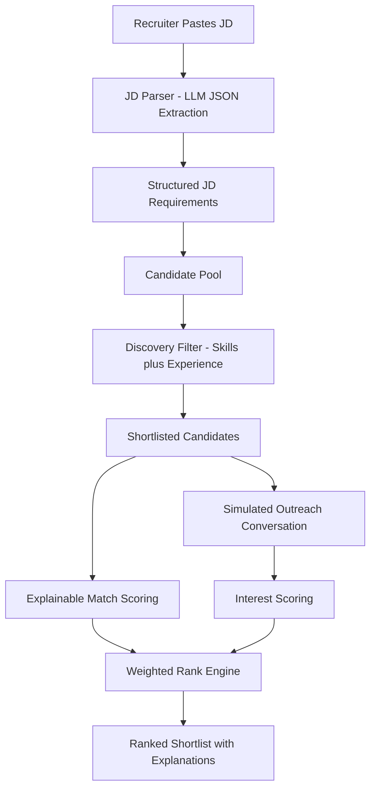

# TalentScout AI - AI-Powered Talent Scouting and Engagement Agent

TalentScout AI helps recruiters move from a raw Job Description (JD) to an actionable ranked shortlist quickly.

It automates:
- JD parsing into structured requirements
- Candidate discovery and pre-filtering
- Explainable match scoring
- Simulated recruiter outreach conversation
- Interest scoring
- Final ranked shortlist using weighted Match + Interest scores

## Live App

- Streamlit: [https://ai-talent-scout.streamlit.app](https://ai-talent-scout.streamlit.app)
- GitHub: [https://github.com/nikithchowdaryachanta/ai-talent-scout](https://github.com/nikithchowdaryachanta/ai-talent-scout)

## Working Prototype

This project is available as:
- **Deployed prototype**: [https://ai-talent-scout.streamlit.app](https://ai-talent-scout.streamlit.app)
- **Local runnable setup**: follow the steps in `Local Setup` and run:
  - `python -m streamlit run app.py`

## Features

- **Structured JD parsing**: extracts role, must-have and nice-to-have skills, minimum experience, location, seniority, and summary.
- **Candidate discovery stage**: applies a quick rule-based filter on skill overlap and experience before deeper scoring.
- **Explainable match score**:
  - matched must-have skills
  - missing must-have skills
  - matched nice-to-have skills
  - rationale text for recruiter confidence
- **Simulated outreach**: generates a short recruiter-candidate conversation.
- **Interest score**: estimates candidate interest from simulated outreach context.
- **Recruiter controls**:
  - shortlist size
  - match/interest weight adjustment

## Architecture Diagram (Pipeline Flow)



## Tech Stack

- Python
- Streamlit
- Google Generative AI (Gemini)
- python-dotenv

## Local Setup

1. Clone repository:
   - `git clone https://github.com/nikithchowdaryachanta/ai-talent-scout.git`
2. Move into project:
   - `cd ai-talent-scout`
3. Install dependencies:
   - `python -m pip install -r requirements.txt`
4. Add environment variable in `.env`:
   - `GOOGLE_API_KEY=your_api_key_here`
5. Run app:
   - `python -m streamlit run app.py`

## Streamlit Cloud Deployment

1. Open Streamlit Community Cloud and connect the repository.
2. Select branch: `main`
3. Main file: `app.py`
4. Add secret:

```toml
GOOGLE_API_KEY="your_api_key_here"
```

5. Deploy.

## Sample JD (Demo / Interview)

Use this sample JD to demo the full flow:

```text
Role: AI/ML Engineer
Location: Remote (India)
Experience: 3+ years

We are looking for an AI/ML Engineer with strong Python skills and hands-on experience building and deploying machine learning models.

Must have:
- Python
- Machine Learning
- SQL
- Model deployment experience

Good to have:
- NLP or Computer Vision
- MLOps tooling
- Cloud platform exposure (AWS/GCP/Azure)

Responsibilities:
- Build, evaluate, and deploy ML models
- Collaborate with product and engineering teams
- Improve model performance and reliability in production
```

## Expected Output Shape

When the agent runs, it provides:

- **Ranked shortlist** with
  - Match Score
  - Interest Score
  - Final weighted score
- **Explainability block**
  - matched/missing skills
  - reasoning text
- **Simulated outreach transcript**
  - recruiter-candidate conversation turns
- **JD analysis tab**
  - extracted structured fields
- **Discovery pool tab**
  - candidates that passed initial filter

## Sample Output (Example)

For the sample JD above, a typical output looks like:

```text
Ranked Shortlist
1) Arjun V (AI Engineer, Pune)
   Match Score: 88
   Interest Score: 76
   Final Score: 83
   Why:
   - Matched must-have: Python, ML/Deep Learning equivalent, deployment exposure
   - Missing must-have: strict SQL emphasis
   - Nice-to-have matched: Computer Vision, MLOps

2) Rahul N (ML Engineer, Bengaluru)
   Match Score: 82
   Interest Score: 73
   Final Score: 78

3) Meera T (Full Stack Engineer, Remote)
   Match Score: 71
   Interest Score: 69
   Final Score: 70
```

And the **JD Analysis** tab returns structured JSON such as:

```json
{
  "role": "AI/ML Engineer",
  "must_have_skills": ["Python", "Machine Learning", "SQL", "Model Deployment"],
  "nice_to_have_skills": ["NLP", "Computer Vision", "MLOps", "Cloud"],
  "min_experience_years": 3,
  "location": "Remote (India)",
  "seniority": "Mid",
  "summary": "Hands-on AI/ML role focused on building and deploying production models."
}
```

## Scoring Logic

- Final Score = `(Match Score * match_weight) + (Interest Score * interest_weight)`
- Default weights in UI:
  - Match = 60%
  - Interest = 40%

Recruiters can change these weights from the sidebar.

## Notes

- `.env` is excluded from Git.
- `__pycache__/` and `*.pyc` are ignored.
- If LLM JSON is malformed, fallback defaults keep the app usable.
- Output values vary per run due to LLM response variability.
